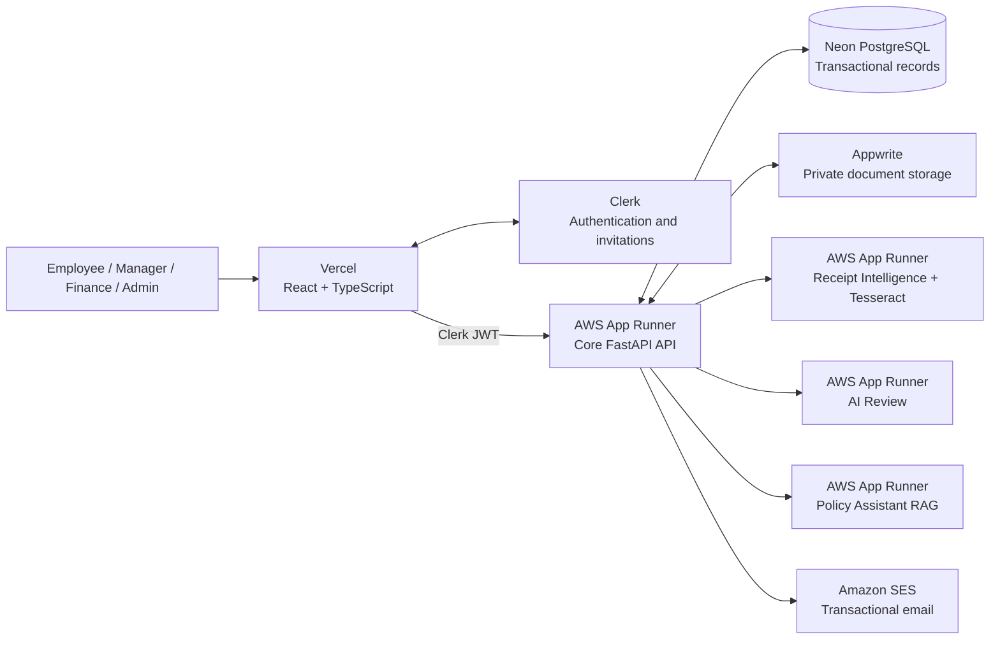
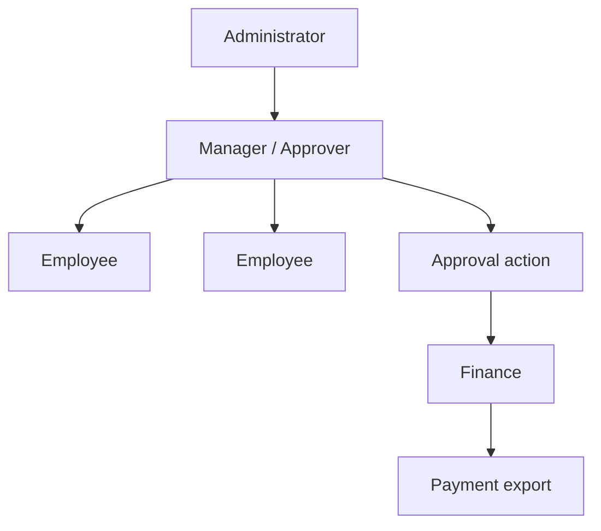
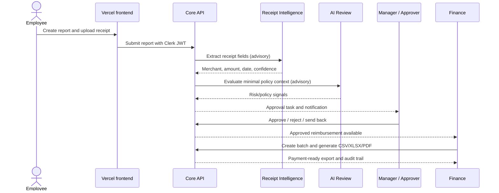
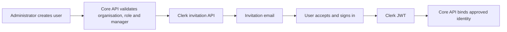

# Reimbursement Tool — Intern Capstone Project

Reimbursement Tool is an **intern capstone project** that I built during my internship at Presidio. It helps manage employee expense reimbursements through report submission, approvals, payment exports, audit logging, OCR, and policy-aware AI assistance.

This repository documents the project, its architecture, and the workflows it demonstrates.

One core design principle guides the project: automation can advise, extract, classify, and explain; only the core workflow is designed to approve, reject, pay, or change financial records.

## Contents

- [What the platform does](#what-the-platform-does)
- [Architecture](#architecture)
- [Repository map](#repository-map)
- [Roles and reporting hierarchy](#roles-and-reporting-hierarchy)
- [End-to-end workflow](#end-to-end-workflow)
- [AI and OCR boundaries](#ai-and-ocr-boundaries)
- [Authentication and invitations](#authentication-and-invitations)
- [Local development](#local-development)
- [Configuration and secrets](#configuration-and-secrets)
- [Testing and quality gates](#testing-and-quality-gates)
- [Demonstration deployment flow](#demonstration-deployment-flow)
- [Operations and troubleshooting](#operations-and-troubleshooting)
- [Security model](#security-model)

## What the platform does

### Core workflow

1. An administrator invites a user and assigns their organisation access, department, role(s), and reporting manager.
2. The user accepts the Clerk invitation and signs in through the approved identity provider.
3. An employee creates a reimbursement report in INR, adds expense lines, and attaches receipts.
4. Receipt Intelligence extracts advisory OCR data; policy rules and the AI Review service identify potential concerns.
5. The report follows the configured multi-level approval chain. A manager can approve, reject, or send it back.
6. Finance creates payment batches and exports approved reimbursements as CSV, Excel, or PDF for the finance team’s external payment process.
7. Notifications, comments, audit events, and export history make the complete process traceable.

### Product capabilities

- India-aware expense reporting, INR defaults, tax/VAT fields where configured, and payment exports.
- Nested expense categories, vendors, policy versions, archive/restore operations, and department-aware people management.
- Multi-stage approval, delegated approvals, SLA tracking, comments, notifications, and audit exports.
- Receipt OCR with low-confidence, unsupported-PDF, and unavailable-service states.
- Policy document ingestion plus a retrieval-augmented assistant that answers from approved policy evidence with citations.
- Custom React UI using Tailwind, Radix primitives, Phosphor icons, and an orange/pink design system.

## Architecture



### Responsibility boundaries

| Component | Owns | Must not do |
| --- | --- | --- |
| Frontend | Presentation, client-side interaction, Clerk session acquisition | Store server secrets or make authorization decisions |
| Core API | RBAC, reports, approvals, exports, audit records, tenant scope | Delegate final approval/payment decisions to AI |
| Receipt Intelligence | OCR and receipt data extraction | Mutate a report or access the transactional database |
| AI Review | Advisory risk and policy signals | Approve, reject, or pay a reimbursement |
| Policy Assistant | Citation-grounded answers from approved policy documents | Read another organisation’s evidence or mutate policy/workflow state |
| Neon | Transactional system of record | Store document blobs |
| Appwrite | Private document storage and supporting platform services | Hold Neon credentials or approve payments |
| Clerk | Sign-in, session lifecycle, invitation acceptance | Own application roles, reporting lines, or approval permissions |

## Repository map

```text
.
├── frontend/                     React application (Vercel deployment target)
│   ├── src/auth/                 Clerk session and permission adapter
│   ├── src/components/           Shared design-system and application shell
│   ├── src/features/             Feature-local pages, APIs, and tests
│   └── e2e/                      Playwright browser coverage
├── backend/                      Core FastAPI application (AWS deployment target)
│   ├── app/api/                  HTTP routes and request schemas
│   ├── app/services/             Workflow, export, storage, audit, and Clerk logic
│   ├── app/models/               SQLAlchemy domain models
│   ├── alembic/                  Database migration environment and revisions
│   └── tests/                    API, RBAC, workflow, and service coverage
├── ai_review_service/            Isolated advisory risk-analysis microservice
├── receipt_intelligence_service/ Isolated Tesseract OCR microservice
├── policy_assistant_service/     Isolated policy RAG microservice
├── database/schema.dbml          Current database design in DBML
├── deployment/                   Docker, Terraform, and deployment scripts
├── scripts/                      Safe local developer entry points
├── .github/workflows/            CI, CodeQL, secret scanning, production CD
└── appwrite.config.json          Appwrite schema/storage definition; no credentials
```

Each service owns its own `pyproject.toml`, lockfile, Dockerfile, environment example, tests, and concise service README. Cross-service policies live at the repository root so that deployment boundaries remain obvious.

## Roles and reporting hierarchy

The tool deliberately exposes exactly four application roles. Roles are additive: a reporting manager normally has both Employee and Manager / Approver roles.

| Role | Typical responsibility | Key permissions |
| --- | --- | --- |
| Employee | Create and track their own reports | Report creation, receipt upload, comments, read access |
| Manager / Approver | Review reports from direct and escalated reports | Report review, approve/reject/send back, delegation |
| Finance | Prepare approved reimbursements for external payment | Read approved reports, manage batches, generate exports |
| Administrator | Configure people, policy, categories, workflow, and operations | Full platform administration |



To add a reporting manager, create or update that person with the **Manager / Approver** role first. They then appear in the reporting-manager selector for their direct reports. Every person record shows its organisation, department, role set, and manager.

## End-to-end workflow



## AI and OCR boundaries

The sidebar labels AI-backed capabilities so operators can distinguish advisory services from core workflow controls.

### Receipt Intelligence

- Uses Tesseract in its AWS image.
- Extracts receipt evidence and supplies confidence values.
- Returns an explicit unavailable or low-confidence state rather than inventing data.
- Does not make a reimbursement decision.

### AI Review

- Receives a minimized snapshot, not direct database access.
- Uses Groq where configured.
- Produces explainable advisory signals for reviewer attention.
- Never changes report status or payment state.

### Policy Assistant RAG

- Uses administrator-uploaded policy documents as a tenant-scoped knowledge base.
- Returns document citations with answers.
- Does not use policy documents from another organisation or version.
- Does not make workflow or payment decisions.

## Authentication and invitations

Public sign-up is disabled. Administrators create access through the Users page.



The core API stores application access data before the invitation is accepted. Clerk owns the identity lifecycle; the API owns roles, tenant scope, department, and reporting hierarchy. If Clerk invitation provisioning is not configured, user creation fails safely instead of creating a local account that cannot sign in.

## Local development

### Prerequisites

- Node.js 22+
- Python 3.14 and `uv`
- Docker (for container parity and local services)
- A Neon development database or a local PostgreSQL instance
- Clerk development credentials for browser sign-in testing

### Start services

```bash
# Configure environment files from the provided examples first.
./scripts/run-local-services.sh

# In another terminal.
cd frontend
npm install
npm run dev
```

The frontend defaults to `http://localhost:5173`. The backend exposes health at `/api/health`.

### Run an individual component

```bash
cd backend
uv sync
uv run alembic upgrade head
uv run uvicorn app.main:app --reload

cd ../frontend
npm run dev
```

## Configuration and secrets

Never commit `.env` files, key material, service-account files, Neon URLs, SMTP passwords, Clerk secret keys, Groq keys, or AWS credentials.

| Location | Contains | Safe for source control? |
| --- | --- | --- |
| `backend/.env.example` and service `.env.example` files | Variable names and non-secret examples | Yes |
| GitHub Actions secrets | CI/CD tokens and deployment inputs | Yes, managed outside Git |
| AWS Secrets Manager | Runtime configuration for App Runner services | Yes, managed outside Git |
| Vercel environment variables | Frontend public configuration only | Yes, managed outside Git |
| Local `.env`, `.env.local`, `.vercel`, `.claude`, `.kilo` | Machine-specific values/tool state | No |

For invitation provisioning, the core API needs these server-side environment values:

```text
CLERK_SECRET_KEY=<Clerk backend secret>
CLERK_INVITATION_REDIRECT_URL=https://presidio.algoqx.tech/sign-in
```

The Clerk secret belongs only in AWS Secrets Manager. It must never be added to Vercel or frontend variables.

## Testing and quality gates

```bash
# Core application
cd backend && uv run pytest tests -q

# Frontend checks
cd frontend && npm run lint && npm run test && npm run build

# Microservices
cd ai_review_service && uv run pytest -q
cd receipt_intelligence_service && uv run pytest -q
cd policy_assistant_service && uv run pytest -q
```

CI runs the backend, frontend, all three microservices, Terraform formatting/validation, CodeQL, and gitleaks. Pull requests cannot merge until required checks pass. Playwright contains browser smoke coverage; authenticated demonstration journeys should be run with an invitation-only test identity.

## Demonstration deployment flow


`main` is the integration branch for this capstone. The demonstration workflow uses GitHub OIDC for AWS, so it does not need persistent AWS access keys. It deliberately runs Alembic from `DATABASE_URL` alone; database migrations do not depend on JWT or browser-auth settings.

### Demonstration topology

- Frontend: Vercel (`presidio.algoqx.tech`)
- Core API and advisory services: AWS App Runner in `ap-south-1`
- Transactional data: Neon PostgreSQL
- File storage: Appwrite Singapore endpoint
- Authentication: Clerk custom domain
- Outbound email: Amazon SES
- DNS and TLS: Cloudflare and AWS-managed certificate validation

## Operations and troubleshooting

### A user cannot be added

1. Confirm the administrator has `user:create`.
2. Confirm `CLERK_SECRET_KEY` is present on the core API runtime.
3. Confirm the email is not already an active Reimbursement Tool user or pending Clerk invitation.
4. If rate limited, wait for Clerk’s `Retry-After` period; invitation APIs have instance limits.

### A user does not appear as a reporting-manager option

Create or update that person with the **Manager / Approver** role, ensure their account is active, then reopen the user form. A person cannot report to themself.

### OCR is unavailable or low confidence

The UI should show an advisory state, not block data integrity. Check the Receipt Intelligence App Runner health endpoint and Tesseract image deployment. Users can correct extracted data before submission.

### A deployment fails during migrations

Confirm `NEON_DATABASE_URL` is configured in GitHub Actions. Alembic intentionally reads only `DATABASE_URL`; missing Clerk, JWT, SMTP, or AI configuration must not block a schema migration.

### A browser still shows the old UI

Wait for the Vercel deployment tied to the merged `main` commit, then perform a hard refresh. Preview deployments do not replace the configured alias until the workflow completes.

## Security model

- Invitation-only Clerk authentication; no public self-sign-up.
- JWT verification occurs in the core API with issuer, audience, and authorized-party validation.
- Application RBAC is database-controlled and tenant-scoped; it is not trusted from browser role claims.
- Documents are private, and advisory microservices receive narrow, purpose-specific requests.
- Audit events record administration, approval, and payment-export activity.
- CI scans committed history for secrets and validates infrastructure configuration.
- Demonstration/deployment credentials are stored in managed secret systems, never in Git or frontend bundles.

## Contributing

1. Start from current `main` using an `agent/<focused-change>` branch.
2. Keep changes inside the owning component whenever possible.
3. Add or update tests with behaviour changes.
4. Run the relevant local checks before opening a PR.
5. Keep commits focused and use rebase merges to preserve linear history.

For capstone deployment changes, verify both the GitHub Actions deployment and the Vercel deployment before treating the demonstration build as complete.
