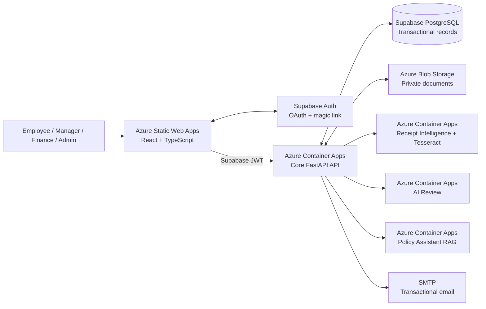
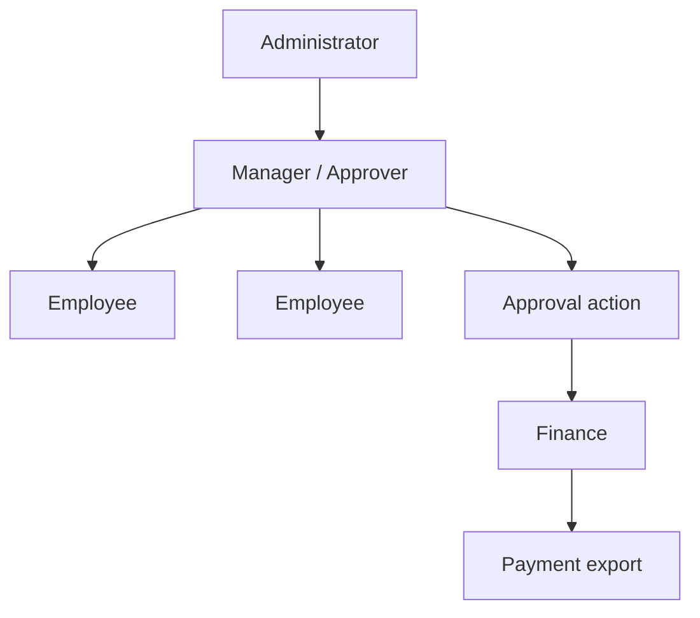
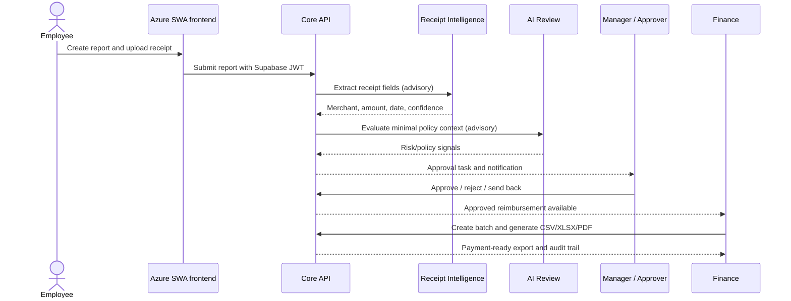
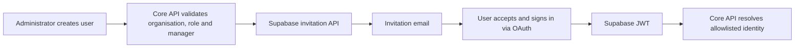
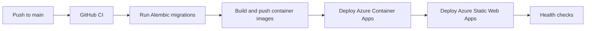

# Reimbursement Tool — Intern Capstone Project

Reimbursement Tool is an **intern capstone project** built during my internship at Presidio. It manages employee expense reimbursements through report submission, multi-level approvals, payment exports, audit logging, OCR, and policy-aware AI assistance.

One core design principle guides the project: automation can advise, extract, classify, and explain; only the core workflow may approve, reject, pay, or change financial records.

## Contents

- [What the platform does](#what-the-platform-does)
- [Architecture](#architecture)
- [Repository map](#repository-map)
- [Roles and reporting hierarchy](#roles-and-reporting-hierarchy)
- [End-to-end workflow](#end-to-end-workflow)
- [AI and OCR boundaries](#ai-and-ocr-boundaries)
- [Authentication and access control](#authentication-and-access-control)
- [Local development](#local-development)
- [Configuration and secrets](#configuration-and-secrets)
- [Testing and quality gates](#testing-and-quality-gates)
- [Production deployment](#production-deployment)
- [Operations and troubleshooting](#operations-and-troubleshooting)
- [Security model](#security-model)

## What the platform does

### Core workflow

1. An administrator creates a user, assigns their organisation, department, role(s), and reporting manager; Supabase sends the invitation email.
2. The user accepts the invitation and signs in through Supabase Auth (Google OAuth or magic link).
3. An employee creates a reimbursement report in INR, adds expense lines, and attaches receipts.
4. Receipt Intelligence extracts advisory OCR data; policy rules and the AI Review service identify potential concerns.
5. The report follows the configured multi-level approval chain. A manager can approve, reject, or send it back.
6. Finance creates payment batches and exports approved reimbursements as CSV, Excel, or PDF.
7. Notifications, comments, audit events, and export history make the complete process traceable.

### Product capabilities

- India-aware expense reporting, INR defaults, tax/VAT fields where configured, and payment exports.
- Nested expense categories, vendors, policy versions, archive/restore operations, and department-aware people management.
- Multi-stage approval, delegated approvals, SLA tracking, comments, notifications, and audit exports.
- Receipt OCR with low-confidence, unsupported-PDF, and unavailable-service states.
- Policy document ingestion plus a retrieval-augmented assistant that answers from approved policy evidence with citations.
- Custom React UI using Tailwind, Radix primitives, Phosphor icons, and an orange/pink design system.

## Architecture



### Responsibility boundaries

| Component | Owns | Must not do |
| --- | --- | --- |
| Frontend | Presentation, client-side interaction, Supabase session | Store server secrets or make authorization decisions |
| Core API | RBAC, reports, approvals, exports, audit records, tenant scope | Delegate final approval/payment decisions to AI |
| Receipt Intelligence | OCR and receipt data extraction | Mutate a report or access the transactional database |
| AI Review | Advisory risk and policy signals | Approve, reject, or pay a reimbursement |
| Policy Assistant | Citation-grounded answers from approved policy documents | Read another organisation's evidence or mutate policy/workflow state |
| Supabase | Authentication, invitation emails, session lifecycle | Own application roles, reporting lines, or approval permissions |
| Azure Blob Storage | Private document storage | Hold database credentials or approve payments |

## Repository map

```text
.
├── frontend/                     React application (Azure Static Web Apps)
│   ├── src/auth/                 Supabase session and access control adapter
│   ├── src/components/           Shared design-system and application shell
│   ├── src/features/             Feature-local pages, APIs, and tests
│   └── e2e/                      Playwright browser coverage
├── backend/                      Core FastAPI application (Azure Container Apps)
│   ├── app/api/                  HTTP routes and request schemas
│   ├── app/services/             Workflow, export, storage, audit logic
│   ├── app/models/               SQLAlchemy domain models
│   ├── app/core/                 Auth, config, observability, rate limiting
│   ├── alembic/                  Database migration environment and revisions
│   └── tests/                    API, RBAC, workflow, and service coverage
├── ai_review_service/            Isolated advisory risk-analysis microservice
├── receipt_intelligence_service/ Isolated Tesseract OCR microservice
├── policy_assistant_service/     Isolated policy RAG microservice
├── database/schema.dbml          Current database design in DBML
├── deployment/                   Terraform (Azure), IAM policies, build scripts
├── scripts/                      Local developer entry points
├── .github/workflows/            CI, secret scanning, Azure CD
└── appwrite.config.json          Appwrite schema/storage definition; no credentials
```

Each service owns its own `pyproject.toml`, lockfile, Dockerfile, environment example, tests, and concise service README. Cross-service policies live at the repository root so that deployment boundaries remain obvious.

## Roles and reporting hierarchy

The tool deliberately exposes exactly four application roles. Roles are additive: a reporting manager normally has both Employee and Manager / Approver roles.

| Role | Typical responsibility | Key permissions |
| --- | --- | --- |
| Employee | Create and track their own reports | Report creation, receipt upload, comments, read access |
| Manager / Approver | Review reports from direct and escalated reports | Report review, approve/reject/send back, delegation |
| Finance | Prepare approved reimbursements for external payment | Read approved reports, manage batches, generate exports |
| Administrator | Configure people, policy, categories, workflow, and operations | Full platform administration |



To add a reporting manager, create or update that person with the **Manager / Approver** role first. They then appear in the reporting-manager selector for their direct reports.

## End-to-end workflow



## AI and OCR boundaries

The sidebar labels AI-backed capabilities so operators can distinguish advisory services from core workflow controls.

### Receipt Intelligence

- Uses Tesseract in its container image.
- Extracts receipt evidence and supplies confidence values.
- Returns an explicit unavailable or low-confidence state rather than inventing data.
- Does not make a reimbursement decision.

### AI Review

- Receives a minimized snapshot, not direct database access.
- Uses Groq or Gemini where configured (multi-provider resilience).
- Produces explainable advisory signals for reviewer attention.
- Never changes report status or payment state.

### Policy Assistant RAG

- Uses administrator-uploaded policy documents as a tenant-scoped knowledge base.
- Returns document citations with answers.
- Does not use policy documents from another organisation or version.
- Does not make workflow or payment decisions.

## Authentication and access control

Public sign-up is disabled. Administrators create access through the Users page.



The core API stores application access data before the invitation is accepted. Supabase Auth owns the identity lifecycle; the API owns roles, tenant scope, department, and reporting hierarchy. Only emails on the application allowlist can access the platform — a verified Supabase identity alone is insufficient.

The first administrator is bootstrapped from the `SUPER_ADMIN_EMAIL` environment variable on first OAuth sign-in to an empty database.

## Local development

### Prerequisites

- Node.js 22+
- Python 3.14 and `uv`
- Docker (for Postgres, Azurite, and MailHog)
- A Supabase project (free tier works) for browser sign-in testing

### Start services

```bash
# Start infrastructure (Postgres, Azurite, MailHog)
cd backend && docker compose up -d

# Run database migrations
uv sync && uv run alembic upgrade head

# Start advisory microservices
./scripts/run-local-services.sh

# Start the backend API (separate terminal)
cd backend && uv run uvicorn app.main:app --reload

# Start the frontend (separate terminal)
cd frontend && npm install && npm run dev
```

The frontend defaults to `http://localhost:5173`. The backend exposes health at `/api/health` and readiness at `/api/ready`.

### Environment setup

Copy `.env.example` files in `backend/` and `frontend/` and fill in your Supabase credentials. Azure Static Web Apps environment variables are configured in the Azure Portal.

## Configuration and secrets

Never commit `.env` files, key material, service-account files, database URLs, SMTP passwords, Supabase service-role keys, or AI provider keys.

| Location | Contains | Safe for source control? |
| --- | --- | --- |
| `backend/.env.example` and service `.env.example` files | Variable names and non-secret examples | Yes |
| GitHub Actions secrets | CI/CD tokens and deployment inputs | Yes, managed outside Git |
| Azure Key Vault | Runtime configuration for Container Apps | Yes, managed outside Git |
| Azure Static Web Apps environment | Frontend public Supabase URL/anon-key only | Yes, managed outside Git |
| Local `.env`, `.env.local` | Machine-specific values | No |

### Key environment variables

```text
# Backend
DATABASE_URL=postgresql://...
AUTH_PROVIDER=supabase
SUPABASE_URL=https://your-project.supabase.co
SUPABASE_JWT_SECRET=your-supabase-jwt-secret
SUPER_ADMIN_EMAIL=admin@yourcompany.com
AZURE_STORAGE_CONNECTION_STRING=...
AZURE_STORAGE_CONTAINER=uploads

# Frontend
VITE_SUPABASE_URL=https://your-project.supabase.co
VITE_SUPABASE_ANON_KEY=your-supabase-anon-key
```

## Testing and quality gates

```bash
# Core application
cd backend && uv run pytest tests -q

# Frontend checks
cd frontend && npm run lint && npm run test && npm run build

# Microservices
cd ai_review_service && uv run pytest -q
cd receipt_intelligence_service && uv run pytest -q
cd policy_assistant_service && uv run pytest -q

# E2E browser tests
cd frontend && npm run test:e2e
```

CI runs the backend, frontend, all three microservices, Terraform formatting/validation, and gitleaks secret scanning. Pull requests cannot merge until required checks pass.

## Production deployment



### Production topology

- **Frontend**: Azure Static Web Apps
- **Core API and advisory services**: Azure Container Apps
- **Transactional data**: Supabase PostgreSQL (core API + all microservices)
- **File storage**: Azure Blob Storage
- **Authentication**: Supabase Auth (Google OAuth)
- **AI provider**: Groq (llama-3.1-8b-instant) — primary for all advisory services
- **Outbound email**: SMTP provider
- **Infrastructure as code**: Terraform (Azure)
- **CI/CD**: GitHub Actions with Azure OIDC federation

### Container images

All services use multi-stage Docker builds with:
- Non-root `app` user (uid 1000)
- Built-in HEALTHCHECK instructions
- Layer-cached dependency installation
- `PORT` environment variable for flexibility

## Operations and troubleshooting

### A user cannot sign in

1. Confirm the user's email is on the application allowlist (created via admin Users page).
2. Confirm `SUPABASE_URL` and `SUPABASE_JWT_SECRET` are correct on the API.
3. Check that the Supabase project has the correct OAuth provider configured.

### The first admin cannot bootstrap

1. Confirm `SUPER_ADMIN_EMAIL` matches the exact email used for OAuth sign-in.
2. Confirm the database is empty (no existing active users).
3. Check API logs for `OAuthBootstrapConfigurationError` details.

### A user does not appear as a reporting-manager option

Create or update that person with the **Manager / Approver** role, ensure their account is active, then reopen the user form. A person cannot report to themself.

### OCR is unavailable or low confidence

The UI shows an advisory state, not a blocking error. Check the Receipt Intelligence container health endpoint. Users can correct extracted data before submission.

### A deployment fails during migrations

Confirm `DATABASE_URL` is configured in GitHub Actions. Alembic intentionally reads only `DATABASE_URL`; missing auth, SMTP, or AI configuration must not block a schema migration.

## Security model

- OAuth-only authentication via Supabase Auth; no public self-sign-up.
- Email allowlist controls platform access — a valid Supabase session alone is insufficient.
- JWT verification with algorithm, subject, and expiry validation.
- Application RBAC is database-controlled and tenant-scoped; not trusted from browser claims.
- Security headers (CSP, X-Frame-Options, HSTS-ready, Permissions-Policy) on all responses.
- Rate limiting on authentication endpoints (10 requests/minute per IP).
- Request correlation IDs for tracing across services.
- Structured JSON logging without PII or request bodies.
- Documents are private; advisory microservices receive narrow, purpose-specific requests.
- Audit events record administration, approval, and payment-export activity.
- CI scans committed history for secrets (gitleaks) and validates infrastructure configuration.
- All credentials stored in managed secret systems, never in Git or frontend bundles.
- Container images run as non-root with minimal attack surface.

## Contributing

1. Start from current `main` using a feature branch.
2. Keep changes inside the owning component whenever possible.
3. Add or update tests with behaviour changes.
4. Run the relevant local checks before opening a PR.
5. Keep commits focused and use rebase merges to preserve linear history.
